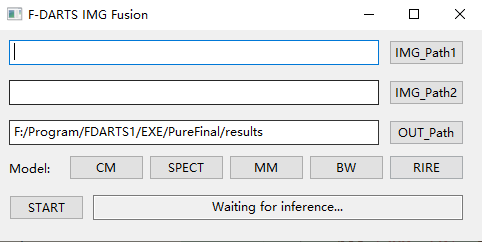

# F-DARTS
These are GUI and test models for our paper titled "Foveated Differentiable Architecture Search Based Multimodal Medical Image Fusion".

**The five trained models for our proposed F-DARTS can be found here. Please note that our method is tested on [Atlas](http://www.med.harvard.edu/AANLIB/), [BrainWeb](https://BrainWeb.bic.mni.mcgill.ca/BrainWeb/) and [RIRE](http://insight-journal.org/rire/)**

DARTS is from [here](https://github.com/quark0/darts).

## Guide
TO DO
### Step 1
Download all current files, and assume the total folder path is "**your_path/F-DRATS/**".

### Step 2
Unzip the "dlls for UI.rar" files to "**your_path/F-DRATS/**", all DLL files are associated with the **UI.exe** in the current folder, for example,

### Step 3
If you have the same **site-packages** used in **requirements.txt**, you can jump to **Step 4**.
or
Install the same package with **requirements.txt**
```bash
$ pip install -r requirements.txt
```
### Step 4
Go to the path **"your_python_path/Lib/site-packages/"**, and copy **"cv2", "numpy", "scipy", "torch" and "wx"** to "**your_path/F-DRATS/**"

### Step 5
Click UI.exe, and you can see a UI like this:




## How To Use
* Click the **IMG_Path1** button, and select the path of the first type images
* Click the **IMG_Path2** button, and select the path of the second type images
* Click the **OUT_Path** button, choose the path to save the output images, or you can use the default path.

* Dataset:
  * [Atlas](http://www.med.harvard.edu/AANLIB/)
    * CM: CT-MR 
    * SPECT: CT/MR-SPECT 
    * MM: Multi-model MR 
  * [BrainWeb](https://BrainWeb.bic.mni.mcgill.ca/BrainWeb/), Multi-model MR
    * BW
  * [RIRE](http://insight-journal.org/rire/), CT-MR
    * RIRE
  * **NOTE**: The names of the images in every dataset are the same, for example, "0001.png" in "/data/CM/1/" and the paired image in "/data/CM/2/" is the same name, and the paired images should be the same size.

* Click the **START** button, and you can see the output images in the **OUT_Path** folder.
  
